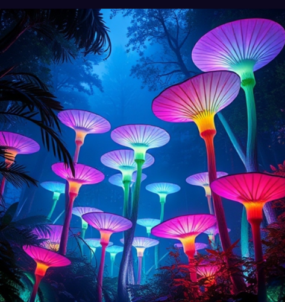
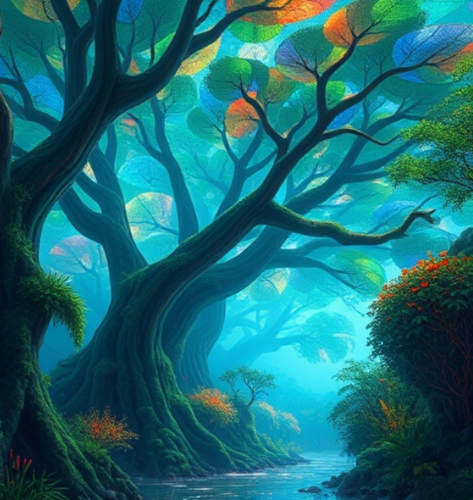
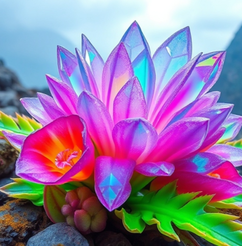
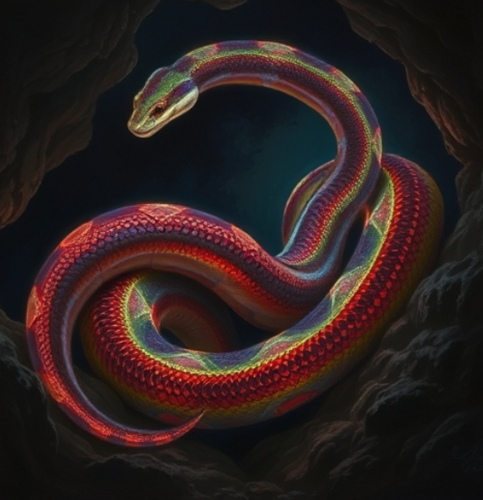
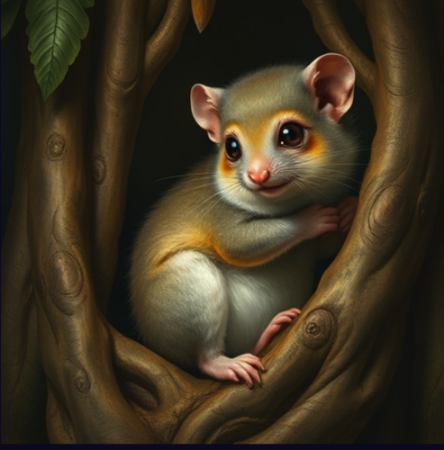
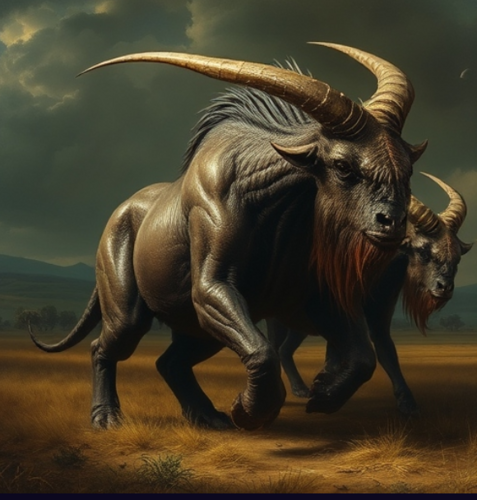
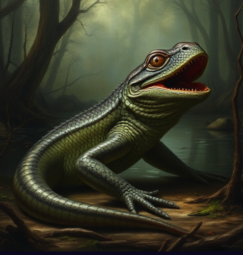

***SPDX-License-Identifier:*** *CC-BY-NC-SA-4.0*

Rescueland has a unique ecosystem, entirely isolated from Earth, which has nurtured a diverse range of flora and fauna. Each species has evolved in distinct ways, adapting to their environment without any similarities to Earth's life forms. This document provides detailed insights into some of the most notable inhabitants, highlighting their physical characteristics, behaviors, habitat, and ecological importance.

# Flora

### Foisa

- **Description:** Foisa are tall, luminescent plants that can reach heights of up to 3 metres. Their spiraled petals are vibrant and exhibit a spectrum of colours that correspond to environmental conditions, such as humidity and temperature.
- **Habitat:** Dense forests with high humidity and ample light, where they thrive in rich, organic matter.
- **Special Features:** 
  - **Luminescence:** The plants emit a soft, bioluminescent glow at night, attracting nocturnal pollinators such as the Kyllar moth.
  - **Medicinal Properties:** The sap of the Foisa is utilized by local fauna for treating injuries due to its healing properties.
  - **Ecological Role:** Foisa stabilizes the forest floor, providing habitat and shelter while forming a crucial part of the food chain, serving as a primary food source for herbivores.

### Verdilune

- **Description:** Verdilune are colossal trees that can exceed 5000 metres in height and possess trunks over 150 metres in diametre. Their foliage is intricate, and they feature leaves with unique textures that adapt to their environment.
- **Habitat:** Floodplains, coastal areas, and riverbanks, where their massive root systems anchor them in soft soil.
- **Special Features:** 
  - **Reflective Canopy:** The leaves have surfaces that create a mirror-like effect, contributing to a unique ecosystem beneath by diffusing light and altering the microclimate.
  - **Resin Production:** The bark secretes a thick, protective resin that is used for various applications, including construction and protection against pests.

### Crystantha

- **Description:** Crystantha produce striking flowers with thick, crystalline formations that can be as large as 30 centimetres across, presenting a dazzling display.
- **Habitat:** Rocky terrains and cliffs where soil is scarce but high in mineral content.
- **Special Features:** 
  - **Water Storage:** The crystalline structures are adept at capturing moisture from the air, providing hydration during dry spells.
  - **Reflective Properties:** These formations scatter light, creating a shimmering effect that can confuse potential predators.
  - **Cultural Importance:** Crystantha flowers are highly valued for their beauty and rarity, often used in decorative crafts and botanical displays.

# Fauna

### Zyfa

- **Description:** Zyfa are large, bioluminescent beings that resemble serpents, measuring up to 6 metres in length. Their skin can emit varying colours based on emotional states and environmental interactions.
- **Habitat:** They inhabit varied terrains, including dense forests, rocky caves, and coastal areas.
- **Special Features:**
  - **Camouflage:** Zyfa are skilled at changing their skin colours to blend into their surroundings, aiding in both predation and evasion from threats.
  - **Sensory Organs:** Advanced sensory organs allow them to detect vibrations in water and air, making them proficient hunters.
  - **Behavioral Patterns:** Typically solitary, Zyfa engage in elaborate mating displays that showcase their light patterns.

### Etecha
- **Description:** Etecha are grand flying beings with massive wingspans reaching up to 88 metres, distinguished by intricate feather patterns that move with the wind.
- **Habitat:** They soar high in altitude, taking residence above mountainous regions and in open skies.
- **Special Features:**
  - **Air Sac Adaptations:** Etecha have evolved air sacs that allow them to soar effortlessly for extended periods.
  - **Communication:** They utilize an array of sounds, mimicking natural phenomena, which aids in communication with others.

### Splotha

- **Description:** Splotha are small, furry creatures measuring about 30 centimetres in length, adorned with iridescent fur that changes colour based on surroundings.
- **Habitat:** Nestled in the underbrush of rainforests, they make their homes among the roots of large trees.
- **Special Features:**
  - **Social Structure:** Splotha live in large familial groups, employing complex chirping vocalizations for social interaction.
  - **Mushroom Diet:** They primarily consume a unique mushroom species that grows symbiotically with their nesting trees.
  - **Ecological Impact:** As vital seed dispersers, they aid in the propagation of various plant species, ensuring ecosystem continuity.

### Nometra

- **Description:** Nometra are large herbivorous creatures, approximately 2.5 metres tall at the shoulder, with muscular bodies suited for endurance.
- **Habitat:** Open grasslands, savannas, and plateaus, where they graze on robust vegetation.
- **Special Features:**
  - **Thick Skin:** Their leathery skin protects against environmental extremes and physical threats.
  - **Migratory Behavior:** Nometra travel in large herds to seek food sources, exhibiting a highly synchronized movement pattern.

### Gromphor

- **Description:** Gromphors are amphibious beings, reaching lengths of up to 2 metres, with smooth, scaled skin adapted for both aquatic and terrestrial environments.
- **Habitat:** They thrive in swamps and wetlands, where they can easily navigate between land and water.
- **Special Features:**
  - **Vocal Abilities:** Their deep croaks resonate over long distances, primarily used during mating rituals and territory establishment.
  - **Color Adaptation:** Gromphors can shift skin colour for camouflage and signaling, aiding in their survival.
  - **Ecological Role:** Acting as both predator and prey, Gromphors help maintain ecological balance, regulating insect populations.

### Sharnok
- **Description:** Sharnoks are agile, quadrupedal creatures with elongated limbs, known for their bioluminescent markings that produce dazzling patterns at night.
- **Habitat:** They inhabit rugged terrains, particularly forests and mountainous regions.
- **Special Features:**
  - **Climbing Skills:** Sharnoks excel in climbing steep surfaces, utilizing their long limbs and sharp claws for stability.
  - **Bioluminescent Communication:** Their light displays convey feelings and intentions, particularly during courtship.
  - **Behavior:** They exhibit playful behaviors, often engaging in social interactions that strengthen community bonds.

### Thundra

- **Description:** Thundras stand tall at around 3 metres and are large creatures resembling a mix of a rhinoceros and a woolly mammoth.
- **Habitat:** Vast grasslands and savannas, where they roam freely in search of food.
- **Special Features:**
  - **Low-Frequency Communication:** They produce deep low-frequency sounds that can be felt through the gas, allowing for communication over long distances among individuals.
  - **Hairy Coat:** Thick, shaggy fur provides protection against varying environmental conditions.

### Pyranith
- **Description:** Pyranith are insect-like beings, measuring up to 50 centimetres long, showcasing vivid colours and elongated bodies.
- **Habitat:** Open fields and forest edges, where they can efficiently survey their surroundings.
- **Special Features:**
  - **Venom Production:** Their specialized glands allow them to produce a luminous venom that immobilizes smaller prey.
  - **Sound Production:** While in flight, Pyranith emit a low hum that serves both mating and territorial purposes.
  - **Role in Ecosystem:** They are significant predators of smaller insects, aiding in the regulation of insect populations while also serving as prey for larger creatures.
