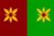

*SPDX-License-Identifier: CC-BY-NC-SA-4.0*

This file presents a brief summary of the major planets, listed according to their distance from Rescueland.

## Keys

**Name:** The name of the planet  

**Flag:** The planet's flag  

**Pronunciation:** How to pronounce the planet's name  

**Capital:** The capital city of the planet  

**Leader:** The planet's leader or its political system  

**Power Status:** Each inhabited planet is assigned a military power ranking from 1 to 6,000,000,000. This may not align with the army size, as some ships are more powerful than others.  

**Army Size:** Total count of military personnel  

- **Interceptors:** Number of interceptors  
- **Battle Ships:** Number of battle ships (includes pocket destroyers)  
- [**Darkfighters:**](./The%20Technology%20of%20Rescueland%2C%20Computerland%20and%20it's%20surrounding%20Planets.md#darkfighters-greyfighters-and-lightfighters) Number of dark fighters (includes grey and lightfighters)  
- **Ground Force:** Total number of foot soldiers

*Note: Rarer ship types have been excluded.*  

**Tech Level:** A measure of technological advancement, rated on a scale of 1 to 12 for military capability:  
1. Stone Age  
2. Medieval Age  
3. Present-Day Earth  
4. Regular transport available within the system  
5. Initial exploration of nearby systems  
6. Colonies established in nearby systems, exploring deeper into their multiverse (Star Wars is at this level)  
7. Technology to occasionally leave their multiverse  
8. Capability to regularly exit their multiverse  
9. Development of more dangerous, system-destroying weaponry  
10. Ship range surpasses the distance from Recua to Computerland and back  
11. Efficient bi-directional conversion of energy and matter
12. Transdimensional exploratory capabilities 

**Population:** Total number of inhabitants  

**Atmosphere:** Primary gases in the atmosphere  

**General:** Overview of pertinent information  

## Contents

- [Core Systems](#core-systems)
  - [The Rescueland System](#the-rescueland-system)
    - [Rescueland (R)](#rescueland-r)
      - [Hermonochy (R)](#hermonochy-r)
    - [Titan (R)](#titan-r)
    - [Ralfialand (R)](#ralfialand-r)
- [Same Universe](#same-universe)
  - [Telor System](#telor-system)
    - [Tortisland (R)](#tortisland-r)
  - [The Bad Guy Land System (B)](#the-bad-guy-land-system-b)
    - [Bad Guy Land (Previously B)](#bad-guy-land-previously-b)
    - [Mega Bad Guy Land (Previously B)](#mega-bad-guy-land-previously-b)
    - [Ultra Bad Guy Land (Previously B)](#ultra-bad-guy-land-previously-b)
  - [Klesone System](#klesone-system)
    - [Klesone (R)](#klesone-r)
      - [Oxo (R)](#oxo-r)
  - [Helucky System](#helucky-system)
    - [Helucky (B)](#helucky-b)
    - [Imperium (Previously B)](#imperium-previously-b)
  - [The Fil System](#the-fil-system)
    - [Filto (R)](#filto-r)
    - [Filna (R)](#filna-r)
    - [Filcho (R)](#filcho-r)
  - [G2320 System](#g2320-system)
    - [Voldim (Previously B)](#voldim-previously-b)
  - [Udas System](#udas-system)
    - [Wana (R)](#wana-r)
    - [Ukakia](#ukakia)
    - [Wonto (R)](#wonto-r)
  - [Rihe System](#rihe-system)
    - [Yelthia (R)](#yelthia-r)
  - [Recola System](#recola-system)
    - [Recola (S)](#recola-s)
  - [Fadet System](#fadet-system)
    - [Fufe (R)](#fufe-r)
  - [Hana System](#hana-system)
    - [N2 (R)](#n2-r)
    - [Nelula (R)](#nelula-r)
    - [Ehana (I)](#ehana-i)
    - [Heloa (R)](#heloa-r)
    - [Keluha (R)](#keluha-r)
  - [Mewfa System](#mewfa-system)
    - [Morrel (I)](#morrel-i)
    - [Nara (R)](#nara-r)
    - [Tonque (R)](#tonque-r)
    - [Naha (R)](#naha-r)
  - [Nad System](#nad-system)
    - [Aquarion (R)](#aquarion-r)
  - [Egla System](#egla-system)
    - [Ignis Terra (R)](#ignis-terra-r)
    - [Glaciera (R)](#glaciera-r)
    - [Terranova (R)](#terranova-r)
- [Outside of Universe](#outside-of-universe)
  - [Prima System](#prima-system)
    - [Wehaya (R)](#wehaya-r)
    - [Alish (R)](#alish-r)
    - [Loaa (R)](#loaa-r)
    - [Yano (R)](#yano-r)
    - [Casopi (R)](#casopi-r)
    - [Senena (I)](#senena-i)
    - [Scanal (I)](#scanal-i)
  - [Computerland System](#computerland-system)
    - [Computerland (I)](#computerland-i)

## Factions  

Various factions exist within the multiverses. The following abbreviations represent the factions to which the planet belongs:  

- **Rescueland Empire:** R  
- **Rebel 10:** B  
- **Separatists:** S  
- **Independent:** I

### Rescueland Empire

**Current Capital:** Rescueland

**Overview:**

Despite the name, The Rescueland Empire is a cooperative entity dedicated to mutual assistance among planets in the multiverse. Officially a republic, it emphasizes democratic values.

**Goals:**

To unify diverse planets under a system of collaboration and support during times of crisis.
To promote peace, stability, and development across the multiverse while serving as a mediator in disputes.

### Rebel 10

**Current Capital:** Helucky

**Overview:**

The Rebel 10 is a faction composed of dissidents and ideologues who believe that the Rescueland Empire's governance is too relaxed and paternalistic. They comprise a diverse coalition, including former planets of the Rescueland Empire and planets that feel marginalized.

**Goals:**

To overthrow the Rescueland leadership, arguing that they can offer better governance and stricter regulations to the planets within its jurisdiction.
To establish a new framework based on direct control and dictatorship.
    

### Separatists

**Current Capital:** Recola

**Overview:**

The Separatists are a shadowy faction harboring a radical ideology focused on dismantling the Rescueland Empire entirely. Their ultimate goal is to plunge the multiverse into chaos, allowing them to establish control over key resources during the ensuing anarchy.

**Goals:**

To eradicate the Rescueland influence and disrupt communications, leaving planets disoriented and vulnerable.
To take advantage of the ensuing chaos to establish their own authoritarian regime.

### Independent

**Overview:**

Not part of any faction.

**Goals:**

To remain completely neutral to the skirmishes between the factions.

# Core Systems

## The Rescueland System

### Rescueland (R)

**Name:** Rescueland/Recua

**Flag:** 

**Pronounced:** resc-ooh-laned/r(with tongue roll)-ekk-ooh-ah

**Capital:** Non-existent

**Leader:** none (However, during war, Commander of War Weda has command of the armies.)

**Power Status:** 5999999997/6000000000

Army Size:
- **Interceptors:** 369 trillion
- **Battle Ships:** 834,000
- **Darkfighters:** 8
- **Ground Force:** 423 septillion

**Tech Level:** 12

**Population:** 8.9798*10^18

**Atmosphere:** Nitrogen 90%, Hydrogen 8%, Oxygen 1%

**General:** Rescueland stands out as the first of the three prominent 'superpowers', alongside Helucky and Recola. What makes Rescueland particularly unique is its focus on the quality and training of its military forces, setting it apart even though it possesses the smallest army among the three superpowers. 
The sheer effectiveness and elite training of Rescueland's troops allow them to compete on equal footing with larger forces. Their emphasis on teamwork and cohesion often leads to a highly disciplined fighting force capable of executing complex maneuvers under pressure.
Geographically, Rescueland is an extraordinary planet, sometimes enveloped by the largest [FFG](./The%20Technology%20of%20Rescueland%2C%20Computerland%20and%20it's%20surrounding%20Planets.md#force-field-gel-r) known in history. In the event of an invasion attempt, the invaders must strategically group and position themselves directly in front of the FFG, waiting for the shield to expire. Invaders must carefully plan their assault, as any miscalculation could result in disastrous consequences.
Rescueland's infrastructure and alliances also play a significant role in its defense strategy. While they may not have the sheer number of troops that Helucky or Recola boast, their innovative use of technology, along with diplomatic relationships developed over the years, provides them with additional layers of security. For the few organic beings living on Rescueland, the local cuisine includes a variety of plant-based dishes, using both native and imported ingredients. While not a dominant religion, some express devotion to the [Super Owls](./The%20Timeline%20of%20Resueland%20History.md#0-adotr-discovery-of-the-rings), holding ceremonies to invoke their blessings for protection and guidance by these seemingly supernatural beings. [Rescueland robots](./The%20Technology%20of%20Rescueland%2C%20Computerland%20and%20it's%20surrounding%20Planets.md#rescueland-robots-r) coexist in a vibrant society where FCRT children go to school, live in houses, and experience a lifecycle reminiscent of living organisms due to the effects of Rescueland Gas. This integration creates a unique blend of culture and community, leading to educational systems and social structures akin to those of organic life.

#### Hermonochy (R)

**Name:** Hermonochy

**Flag:** 

**Pronounced:** Her-mono-cheee

**Capital:** Non-existent

**Leader:** none

**Power Status:** 5048725876/6000000000

Army Size:
- **Interceptors:** 75,000
- **Battle Ships:** 20
- **Darkfighters:** 1
- **Ground Force:** 3 million

**Tech Level:** 11

**Population:** 548 trillion

**Atmosphere:** Hydrogen 86%, Helium 11%, Methane 2%

**General:** This ice moon of Rescueland is where the Rescuelanders hid on during [The War for Rescueland](./The%20Timeline%20of%20Resueland%20History.md#23-24-adotr-the-war-for-rescueland). The terrain is characterized by towering ice formations and expansive tundras, interspersed with labyrinthine caves and underground networks formed over millennia. These caves were vital for the Rescuelanders; they turned them into makeshift strongholds and supply depots, cleverly camouflaging their operations from enemy forces. 

### Titan (R)

**Name:** Titan

**Flag:** 

**Pronounced:** Tie-tai-n

**Capital:** Equi

**Leader:** Monoquia

**Power Status:** 5097748458/6000000000

Army Size:
- **Interceptors:** 1,000
- **Battle Ships:** 5
- **Darkfighters:** 0
- **Ground Force:** 780,000

**Tech Level:** 5

**Population:** 7,200 trillion

**Atmosphere:** Oxygen 57%, Nitrogen 33%, Argon 6%, CO2 3%

**General:** Titan has a very dense foliage and is a very strong supporter of Rescueland. It is about earth size.

### Ralfialand (R)

**Name:** Ralfialand

**Flag:**

**Pronounced:** Ralf-eee-ahh-land

**Capital:** Ralcia

**Leader:** Erros

**Power Status:** 5000132320/6000000000

Army Size:
- **Interceptors:** 2200
- **Battle Ships:** 30
- **Darkfighters:** 0
- **Ground Force:** 4,000

**Tech Level:** 6

**Population:** 7.8 billion

**Atmosphere:** Oxygen 43%, Argon 42%, Neon 14%

**General:** The weakest of the 'core' planets and similar in terrain to Pluto.

# Same Universe

## Telor System

### Tortisland (R)

**Name:** Tortisland

**Flag:**

**Pronounced:** Tor-tis-laned

**Capital:** none

**Leader:** none

**Power Status:** 5063245856/6000000000

Army Size:
- **Interceptors:** 66 million
- **Battle Ships:** 189
- **Darkfighters:** 0
- **Ground Force:** 213 billion

**Tech Level:** 8

**Population:** 34.2 quadrillion

**Atmosphere:**

**General:** Tortisland is the first non-core planet to join the Rescueland Empire. This lush, vibrant planet is primarily covered in dense flora, which plays a unique and vital role in the ecosystem and culture of Tortisland. Unlike any ordinary plant life, the flora on Tortisland exhibits sentience that allows it to communicate and interact with the environment and its inhabitants in extraordinary ways.Their diet incorporates a variety of fruits and vegetables unique to Tortisland. Beliefs are heavily intertwined with nature; their spirituality emphasizes the connectivity between all living beings and the importance of balance.

## The Bad Guy Land System (B)

The Bad Guy Land system is where the Rebel 10 Faction was originally founded. All planets in this system are now under the control of Rescueland.

### Bad Guy Land (Previously B)

**Name:** Bad Guy Land

**Flag:** 

**Pronounced:** Bad Guy Land

**Capital:** Del

**Leader:** Under Rescueland Control

**Power Status:** 4999839420/6000000000

Army Size:
- **Interceptors:** 40 million
- **Battle Ships:** 300
- **Darkfighters:** 0
- **Ground Force:** 438 billion

**Tech Level:** 8

**Population:** 60 trillion

**Atmosphere:** Nitrogen 70%, Oxygen 20%, Sulfur Dioxide 10%

**General:** Before Rescueland asserted control, Bad Guy Land was known for its authoritarian regime, characterized by brutal enforcement tactics and the widespread oppression of its inhabitants. The culture was steeped in militarism, where warfare was viewed as a primary means of maintaining control and asserting dominance over other planets. 
The population largely consisted of enslaved individuals, living under a constant threat of violence. The overall atmosphere was toxic, contributing to the bleak living conditions for its population.
The societal structure was highly stratified, with the elite enjoying privileges while the vast majority suffered under the regime's oppressive policies.

### Mega Bad Guy Land (Previously B)

**Name:** Mega Bad Guy Land

**Flag:**  

**Pronounced:** Meh-gah Bad Guy Land

**Capital:** Ilines

**Leader:** Under Rescueland Control

**Power Status:** 4999999990/6000000000

Army Size:
- **Interceptors:** 50 million
- **Battle Ships:** 600
- **Darkfighters:** 0
- **Ground Force:** 470 million

**Tech Level:** 9

**Population:** 820 million

**Atmosphere:** Nitrogen 60%, Oxygen 30%, Carbon Dioxide 10%

**General:** Mega Bad Guy Land emerged as a significant adversary following the fall of Bad Guy Land, propelled by its desire for vengeance against the Rescueland Empire. With its roots in a culture of militarism and aggression, Mega Bad Guy Land sought to reclaim its standing in the galaxy through direct confrontation. 

### Ultra Bad Guy Land (Previously B)

**Name:** Ultra Bad Guy Land

**Flag:** 

**Pronounced:** Ul-trah Bad Guy Land

**Capital:** Dakhem

**Leader:** Ultra Warlord Malgor

**Power Status:** 5475082105/6000000000

Army Size:
- **Interceptors:** 85 million
- **Battle Ships:** 800
- **Darkfighters:** 0
- **Ground Force:** 15 million

**Tech Level:** 8

**Population:** 150 million

**Atmosphere:** Oxygen 55%, Nitrogen 35%, Methane 10%

**General:** Emerging as a formidable threat following the defeat of Mega Bad Guy Land, Ultra Bad Guy Land is governed by a deeply ingrained hostility toward the Rescueland Empire. Intent on revenge, they initiated a series of retaliatory strikes aimed at destabilizing the Empire while seeking to restore their once-mighty reputation.

## Klesone System

### Klesone (R)

**Name:** Klesone

**Flag:**

**Pronounced:** Kl-eh-sohn-eh

**Capital:** Rrinai

**Leader:** Alpic

**Power Status:** 5908648567/6000000000

Army Size:
- **Interceptors:** 253 trillion
- **Battle Ships:** 2478
- **Darkfighters:** 1
- **Ground Force:** 732 trillion

**Tech Level:** 10

**Population:** 652 quintillion

**Atmosphere:** hydrogen 90%, helium 9%, methane 0.7%

**General:** This planet is massive and hot, and was on the verge of becoming a star. As one of the most powerful supporters of Rescueland, Klesone has played a pivotal role in the empire's technological advancements and military strength. It was here that the [Super Two's](./The%20Timeline%20of%20Resueland%20History.md#18-adotr-the-super-twos) were developed. 

#### Oxo (R)

**Name:** Oxo

**Flag:**

**Pronounced:** Ox-ohh

**Capital:** Rrinai

**Leader:** Alpic

**Power Status:** 5803458538/6000000000

Army Size:
- **Interceptors:** 127
- **Battle Ships:** 3
- **Darkfighters:** 0
- **Ground Force:** 1,780

**Tech Level:** 10

**Population:** 1.2 million

**Atmosphere:** sodium 80%, potassium 18%

**General:** Oxo, a prominent moon that orbits the massive planet Klesone, shares a unique connection with its host world, including the leadership that governs both nations. The landscape is characterized by rugged terrains, expansive plains, and a variety of geologic formations that have been shaped by the gravitational forces of Klesone. While Oxo does not experience the extreme temperatures of its parent planet, it has its own set of environmental challenges that its inhabitants have learned to navigate.

## Helucky System

### Helucky (B)

**Name:** Helucky

**Flag:** 

**Pronounced:** He-luck-ee

**Capital:** Enah

**Leader:** The Great Computer

**Power Status:** 5999999999/6000000000

Army Size:
- **Interceptors:** 764 octillion
- **Battle Ships:** 121,000
- **Darkfighters:** 5
- **Ground Force:** 37 septillion

**Tech Level:** 11

**Population:** 766 octillion

**Atmosphere:** Oxygen 55%, Nitrogen 30%, Trace gases 15%

**General:** Helucky is the most powerful superpower, renowned for its sheer quantity of military resources and strategic capabilities. Its vast landscape is dotted with enormous military installations, factories and spaceports, all dedicated to producing one of the largest spaceborne interceptor armies known in the galaxy.
The planet’s military doctrine revolves around overwhelming force and relentless waves of interceptors, enabling Helucky to effectively defend itself and project power across its sphere of influence. The sheer size of its interceptor army instills a sense of intimidation among rival powers; Helucky could potentially take on not just one, but both superpowers simultaneously. However, despite this advantage in numbers, Helucky faces significant strategic limitations.
The primary obstacle hindering Helucky from launching an outright offensive is its insufficient fleet of battleships. Whereas interceptor crafts excel in air-to-air combat and rapid response, battleships are essential for commanding and controlling operations in vast sectors of space and for engaging formidable opponents effectively. The absence of a robust battleship fleet means that Helucky’s interceptors would be vulnerable when faced with sustained attacks. This vulnerability keeps Helucky leaders cautious, as an attack could leave them exposed to counterattacks and retaliatory strikes.
Moreover, the planet’s leaders are acutely aware of the risks associated with instigating an attack, given the fearsome reputation of Rescueland’s numerous [darkfighters](./The%20Ship%20File.md#dark-grey-and-light-fighters).

### Imperium (Previously B)

**Name**: Imperium  

**Flag**: 

**Pronounced**: Im-per-ee-um  

**Capital:** Kalthar  

**Leader:** Xarendos  

**Power Status:** 5125487350/6000000000  

Army Size:
- **Interceptors:** 65 billion
- **Battle Ships:** 168
- **Darkfighters:** 0
- **Ground Force:** 27 trillion

**Tech Level:** 9

**Population:** 45 trillion

**Atmosphere:** Oxygen 55%, Nitrogen 30%, Trace gases 15%

**General:** The terrain of Imperium is predominantly urban, marked by towering arcologies and fortified structures. The landscape includes expansive industrial zones with heavy machinery and a network of subterranean facilities. The climate is generally temperate but affected by artificial weather manipulation to sustain crop production and maintain comfort in densely populated areas.

## The Fil System

### Filto (R)

**Name:** Filto

**Flag:**

**Pronounced:** Fill-toe

**Capital:** Filha

**Leader:** Eloha

**Power Status:** 5908648566/6000000000

Army Size:
- **Interceptors:** 682 billion
- **Battle Ships:** 897
- **Darkfighters:** 2
- **Ground Force:** 35 trillion

**Tech Level:** 9

**Population:** 45 trillion

**Atmosphere:** Oxygen 55%, Nitrogen 30%, Trace gases 15%

**General:** While weak in traditional firepower, Filto's interceptors are incredibly difficult to destroy, only outmatched by darkfighters. As the primary military manufacturer for all three Fil planets, Filto equips them with advanced military assets, reinforcing their collective defense.

### Filna (R)

**Name:** Filna

**Flag:**

**Pronounced:** Fill-nah

**Capital:** Filoho

**Leader:** Fulah

**Power Status:** 5908648564/6000000000

Army Size:
- **Interceptors:** 0
- **Battle Ships:** 0
- **Darkfighters:** 0
- **Ground Force:** 724

**Tech Level:** 8

**Population:** 780 billion

**Atmosphere:** Oxygen 60%, Nitrogen 30%, Methane 10%

**General:** The weakest of the three Fil planets, Filna is defenseless and relies on Filto for protection. It specializes in the production of civilian goods for the system.

### Filcho (R)

**Name:** Filcho

**Flag:**

**Pronounced:** fill-chow

**Capital:** Filaga

**Leader:** Eholo

**Power Status:** 5908648565/6000000000

Army Size:
- **Interceptors:** 0
- **Battle Ships:** 0
- **Darkfighters:** 0
- **Ground Force:** 783

**Tech Level:** 10

**Population:** 17 billion

**Atmosphere:** Oxygen 65%, Nitrogen 25%, Trace gases 10%

**General:** Filcho focuses on research and exploration, maintaining lightly armed research vessels for defense against potential threats. It plays a crucial role in scientific advancements within the system, supplementing the technologies provided by Filto and contributing to the overall stability and progress of the Fil planets.

## G2320 System

### Voldim (Previously B)

**Name:** Voldim

**Flag:**  

**Pronounced:** Vol-dim

**Capital:** Gorath

**Leader:** Under Rescueland Control

**Power Status:** 2999999995/6000000000

Army Size:
- **Interceptors:** 15 million
- **Battle Ships:** 120
- **Darkfighters:** 0
- **Ground Force:** 35 billion

**Tech Level:** 8

**Population:** 50 billion

**Atmosphere:** Oxygen 40%, Nitrogen 50%, Argon 10%

**General:** Voldim is characterized by its rugged landscapes and militaristic culture where aggression has been cultivated as a means of survival. Historically, the planet sought to expand its reach and influence, instigating conflicts with surrounding planets in the Rescueland Empire. Despite its ambitions, Voldim's military capabilities are outdated, having failed to keep pace with technological advancements seen in the Empire. 

## Udas System

### Wana (R)

**Name:** Wana

**Flag:**

**Pronounced:** Wah-nah

**Capital:** Nezon

**Leader:** King Coators

**Power Status:** 3223200000/6000000000

Army Size:
- **Interceptors:** 3198
- **Battle Ships:** 2
- **Darkfighters:** 0
- **Ground Force:** 675,000

**Tech Level:** 5

**Population:** 50 billion

**Atmosphere:** Oxygen 60%, Nitrogen 30%, Argon 10%

**General:** A hub for experimental technologies, Wana fosters new inventions that support other planets' advancements.

### Ukakia

Name: Ukakia  

Flag:

Pronounced: ooh-kay-key-ahh  

Capital: Akeris Tower  

Leader: Vardok  

Power Status: 3891024765/6000000000  

Army Size:  
Interceptors: 32 billion
Battle Ships: 102
Darkfighters: 0
Ground Force: 15 trillion

Tech Level: 8  

Population: 180 trillion  

Atmosphere: Oxygen 60%, Nitrogen 25%, Sulfur Dioxide 10%, Argon 5%  

General: The surface of Ukakia is a mix of sprawling metropolitan areas and rugged terrain, dominated by the towering Akeris Tower, a massive structure serving as both the political heart and defensive stronghold of the planet. With a history of militaristic rule, the populace is gradually awakening to the possibility of a new order, as recent conflicts have instigated significant civil unrest against their oppressive leaders. 

### Wonto (R)

**Name:** Wonto

**Flag:**

**Pronounced:** Won-toe

**Capital:** Havenford

**Leader:** Tsar Protader

**Power Status:** 3400000000/6000000000

Army Size:
- **Interceptors:** 14
- **Battle Ships:** 1
- **Darkfighters:** 0
- **Ground Force:** 387

**Tech Level:** 6

**Population:** 2 billion

**Atmosphere:** Oxygen 45%, Carbon Dioxide 30%, Helium 25%

**General:** A small, peaceful planet focused on ecological restoration, Wonto is rich in biodiversity and dedicated to preserving life.

## Rihe System

### Yelthia (R)

**Name:** Yelthia

**Flag:** 

**Pronounced:** Yell-thee-ah

**Capital:** Taruka

**Leader:** Zoltar

**Power Status:** 4400576250/6000000000

Army Size:
- **Interceptors:** 4.5 million
- **Battle Ships:** 60
- **Darkfighters:** 0
- **Ground Force:** 150 million

**Tech Level:** 8

**Population:** 90 billion

**Atmosphere:** Oxygen 55%, Carbon Dioxide 25%, Methane 20%

**General:** Yelthia is notable for its vast desert landscapes interrupted by immense structures formed from peculiar crystal formations, which serve both as homes and defensive structures. The culture thrives on innovation and adaptability, creating highly mobile military units that navigate through its challenging environment.

## Recola System

### Recola (S)

**Name:** Recola

**Flag:** 

**Pronounced:** Re-coal-ahh

**Capital:** Gnogo

**Leader:** Emperor Astan

**Power Status:** 5999999998/6000000000

Army Size:
- **Interceptors:** 567 quadrillion
- **Battle Ships:** 6780
- **Darkfighters:** 3
- **Ground Force:** 146 hexillion

**Tech Level:** 12

**Population:** 380 hexillion

**Atmosphere:** Nitrogen 59%, Oxygen 30%, Argon 10%

**General:** Recola stands as the enigmatic third superpower, emphasizing unparalleled speed in its fleet at the expense of several key systems like shields. This strategic choice enables its ships to outperform rivals in agility and rapid strike capability. Specializing in radar and radio manipulation, Recola has skillfully influenced the outcome of the Rescueland-Helucky war, playing both sides from the shadows. The exact size of Recola's forces and the location of its home planet remain undiscovered by the other two superpowers, which refer to it simply as “The Third Army.” This secrecy grants Recola a significant advantage, allowing it to maneuver strategically without revealing its capabilities or intentions.

## Fadet System

### Fufe (R)

**Name:** Fufe

**Flag:** 

**Pronounced:** Foo-fay

**Capital:** Brir

**Leader:** The Unitary Council

**Power Status:** 2900000000/6000000000

Army Size:
- **Interceptors:** 679
- **Battle Ships:** 7
- **Darkfighters:** 0
- **Ground Force:** 45 million

**Tech Level:** 5

**Population:** 250 million

**Atmosphere:** Nitrogen 50%, Oxygen 35%, Argon 15%

**General:** A vibrant agricultural planet, Fufe exports food supplies, featuring colorful crops and unique flora.

## Hana System

### N2 (R)

**Name:** N2

**Flag:** 

**Pronounced:** enn-too

**Capital:** None

**Leader:** None

**Power Status:** 0000000310/6000000000

Army Size:
- **Interceptors:** 0
- **Battle Ships:** 0
- **Darkfighters:** 0
- **Ground Force:** 17,000

**Tech Level:** 1

**Population:** 15 million

**Atmosphere:** Nitrogen 70%, Oxygen 25%, Argon 4%

**General:** N2 is the weakest planet in the Rescueland Empire, having joined under duress due to [threats from Bad Guy Land](./The%20Timeline%20of%20Resueland%20History.md#21-adotr-the-first-battle-against-bad-guy-land). The population is divided into numerous tribes, each averaging about a thousand inhabitants, and they are still in the Stone Age, on the cusp of entering the Bronze Age.   
Life on N2 revolves around basic agriculture, foraging, and rudimentary hunting techniques, with communities primarily focused on survival. The tribes maintain a decentralized structure, with no formal leadership, relying instead on elder councils for guidance in communal matters.   
The inhabitants have developed a belief system that venerates the concept of Rescueland as a pantheon of divine forces that govern their existence and protect them from external threats. Each tribe worships the ideals of Rescueland, viewing them as benevolent deities that saved them from the threat of Bad Guy Land. The tribes refer to the ideals of Rescueland as "The Protectors." Oral traditions are rich with tales of legendary figures representing the ideals of Rescueland. These stories serve to inspire the youth and instill a sense of purpose as they learn about courage and resilience through the narratives of their "gods."

### Nelula (R)

**Name:** Nelula

**Flag:** 

**Pronounced:** Neh-loo-lah

**Capital:** Mediay

**Leader:** Kahn Coars

**Power Status:** 3600000000/6000000000

Army Size:
- **Interceptors:** 2 million
- **Battle Ships:** 43
- **Darkfighters:** 0
- **Ground Force:** 29 million

**Tech Level:** 7

**Population:** 1.5 billion

**Atmosphere:** Oxygen 55%, Nitrogen 30%, Carbon Dioxide 15%

**General:** Nelula serves as the guardian of N2, ensuring no major threats arise against its smaller neighbor.The people of Nelula hold a steadfast belief in the concept of guardianship. They consider themselves protectors of weaker worlds, which translates into their governance and military strategy.

### Ehana (I)

**Name:** Ehana

**Flag:** 

**Pronounced:** Ay-hahn-ah

**Capital:** Oarime

**Leader:** High Lord Tacer

**Power Status:** 3100000000/6000000000

Army Size:
- **Interceptors:** 7430
- **Battle Ships:** 87
- **Darkfighters:** 0
- **Ground Force:** 59 million

**Tech Level:** 6

**Population:** 600 million

**Atmosphere:** Hydrogen 40%, Oxygen 30%, Helium 30%

**General:**  Ehana is a desert planet that harnesses the power of solar energy, using advanced technology to optimize their resources effectively. Once part of the Rescueland Empire, Ehana has made history by becoming the first planet to willingly leave the empire, under the belief that they are self-sufficient enough to thrive independently. High Lord Tacer leads with a vision of autonomy and sustainability.

### Heloa (R)

**Name:** Heloa

**Flag:** 

**Pronounced:** Heh-lo-ah

**Capital:** Lumen City

**Leader:** Luncil

**Power Status:** 3700000000/6000000000

Army Size:
- **Interceptors:** 46,000
- **Battle Ships:** 81
- **Darkfighters:** 0
- **Ground Force:** 75 million

**Tech Level:** 7

**Population:** 800 million

**Atmosphere:** Oxygen 50%, Nitrogen 40%, Trace gases 10%

**General:** Known for its deep-space exploration programs, Heloa is home to Lumen University, a prestigious institution.

### Keluha (R)

**Name:** Keluha

**Flag:** 

**Pronounced:** Keh-loo-hah

**Capital:** Cryre

**Leader:** Copace

**Power Status:** 4074491000/6000000000

Army Size:
- **Interceptors:** 93,000
- **Battle Ships:** 650
- **Darkfighters:** 0
- **Ground Force:** 829 million

**Tech Level:** 8

**Population:** 112 billion

**Atmosphere:** Oxygen 60%, Argon 20%, Neon 20%

**General:** Keluha is a planet abundant in crystalline resources that draw commercial interests, while also prioritizing technological advancements in resource management. Located strategically within a remote mountain range is a Helucky stronghold, which is well-suited for launching offensive operations against neighboring systems. This base, currently under the precarious control of Recola, occupies a critical position that enables it to strike at key planets before Rescueland has the chance to mobilize its defenses. The ongoing conflict between Helucky and Recola for control of this base carries significant implications for the regional balance of power. Despite facing heavy casualties, Recola remains resolute in its efforts to maintain its position, knowing that losing Keluha could lead to a dramatic shift in their fortunes.

## Mewfa System

### Morrel (I)

**Name:** Morrel

**Flag:** 

**Pronounced:** Moh-r (with tongue roll) -ell

**Capital:** unknown

**Leader:** unknown

**Power Status:** 5031270958/6000000000

Army Size:
- **Interceptors:** Approx 1700
- **Battle Ships:** Approx 80
- **Darkfighters:** N/A
- **Ground Force:** 7 - 15 billion

**Tech Level:** unknown

**Population:** 8 - 20 billion

**Atmosphere:**

**General:** Morrel is shrouded in mystery, and its civilization is rumored to possess the potential to operate magic, specifics about its army size and capabilities undisclosed. Those who have glimpsed Morrel's defenses suggest that they are enchantments and mystical constructs rather than traditional military units.

### Nara (R)

**Name:** Nara

**Flag:** 

**Pronounced:** narr-ah

**Capital:** The Cloudspire

**Leader:** Thegences

**Power Status:** 4556732960/6000000000

Army Size:

- **Interceptors:** 5,000
- **Battle Ships:** 32
- **Darkfighters:** 0
- **Ground Force:** 90 million

**Tech Level:** 7

**Population:** 5.2 quadrillion

**Atmosphere:** Oxygen 40%, Argon 30%, Neon 26%

**General:** Nara is a planet shrouded in dense clouds, most cities being a single, colossal tower. It is renowned for its atmospheric processors that harvest energy from storms, the main supply of energy.

### Tonque (R)

**Name:** Tonque

**Flag:** 

**Pronounced:** Ton-keh

**Capital:** Ironhold

**Leader:** Auor

**Power Status:** 5200000000/6000000000

Army Size:

- **Interceptors:** 212,000
- **Battle Ships:** 58
- **Darkfighters:** 0
- **Ground Force:** 319 million

**Tech Level:** 8

**Population:** 100 billion

**Atmosphere:** Carbon Dioxide 70%, Sulphur Dioxide 20%, Methane 10%

**General:** Known for its vast mines, Tonque is a heavily industrialised planet where robots specialise in metal extraction and manufacturing.

### Naha (R)

**Name:** Naha

**Flag:** 

**Pronounced:** nah-hah

**Capital:** Starlight Haven

**Leader:** Prime Minister Equats

**Power Status:** 3000000000/6000000000

Army Size:

- **Interceptors:** 115
- **Battle Ships:** 5
- **Darkfighters:** 0
- **Ground Force:** 12 million

**Tech Level:** 7

**Population:** 380 million

**Atmosphere:** Nitrogen 50%, Oxygen 36%, Argon 13%

**General:** A visually stunning planet with bioluminescent flora, Naha is one of the largest attractions for artists and biologists.

## Nad System

### Aquarion (R) 

**Name:** Aquarion

**Flag:** 

**Pronounced:** ah-kwah-ree-on

**Capital:** Tidal City

**Leader:** King Counics

**Power Status:** 3800000000/6000000000

Army Size:

- **Interceptors:** 20
- **Battle Ships:** 4
- **Darkfighters:** 0
- **Ground Force:** 100,000

**Tech Level:** 6

**Population:** 2,500,000

**Atmosphere:** Water Vapour 70%, Oxygen 20%, Nitrogen 10%

**General:** Primarily covered by vast oceans, Aquarion consists of only 2.3% landmass, limiting its capacity to support a large population. This small percentage of land is interspersed with coastal settlements and floating cities, where the majority of its inhabitants reside.

## Egla System

### Ignis Terra (R)

**Name:** Ignis Terra

**Flag:** 

**Pronounced:** ig-niss ter-ra

**Capital:** Flold

**Leader:** Supreme Pyot

**Power Status:** 4900000000/6000000000

Army Size:

- **Interceptors:** 300,000
- **Battle Ships:** 175
- **Darkfighters:** 0
- **Ground Force:** 5 billion

**Tech Level:** 9

**Population:** 800 trillion

**Atmosphere:** Carbon Monoxide 50%, Vaporized Minerals 30%, Oxygen 20%

**General:** A volcanic planet with intense geothermal activity, Ignis Terra is characterised by its heat-based technologies.

### Glaciera (R)

**Name:** Glaciera

**Flag:**

**Pronounced:** glas-ee-air-ah

**Capital:** Frosthaven

**Leader:** Ice Council

**Power Status:** 3200000000/6000000000

Army Size:

- **Interceptors:** 50
- **Battle Ships:** 8
- **Darkfighters:** 0
- **Ground Force:** 1 million

**Tech Level:** 5

**Population:** 1.2 trillion

**Atmosphere:** Oxygen 60%, Methane 25%, Nitrogen 15%

**General:** Glaciera is a frozen world characterized by vast glaciers, towering ice formations, and an unyielding blanket of snow. The planet's surface is largely inhospitable due to extreme cold, but pockets of geothermal activity allow for habitable zones. Glaciera's inhabitants are masters of thermal technology, enabling them to thrive in the harsh freeze. They possess advanced techniques for manipulating heat and crafting materials that withstand the cold, allowing them to create intricate cities and machinery that function optimally in low-temperature environments.

### Terranova (R)

**Name:** Terranova

**Flag:** 

**Pronounced:** tehr-ra-nov-ah

**Capital:** Fres City

**Leader:** Governor Ecard

**Power Status:** 3650000000/6000000000

Army Size:

- **Interceptors:** 150,000
- **Battle Ships:** 20
- **Darkfighters:** 0
- **Ground Force:** 1 million

**Tech Level:** 6

**Population:** 4 billion

**Atmosphere:** Oxygen 40%, Nitrogen 40%, Carbon Dioxide 20%

**General:** Terranova is one of the greenest planets known, with 90% of the planet being covered in some form of plant.

# Outside of Universe

## Prima System

### Wehaya (R)

**Name:** Wehaya  

**Flag:** 

**Pronounced:** Weh-hah-yah  

**Capital:** Talaris  

**Leader:** Elorik  

**Power Status:** 2750056120/6000000000  

**Army Size:**  
- **Interceptors:** 22,000  
- **Battle Ships:** 75
- **Darkfighters:** 0 
- **Ground Force:** 10 trillion  

**Tech Level:** 7  

**Population:** 120 trillion  

**Atmosphere:** Oxygen 58%, Nitrogen 32%, Argon 8%, Trace gases 2%  

**General:** Wehaya is characterized by its expansive forests and vast oceans, with cities built on stilts to accommodate rising sea levels. Its military is somewhat underfunded, but the populace is known for their resourcefulness and resilience. The social structure is divided between those who support the ruling council and a  advocating for greater autonomy and environmental protections.

### Alish (R)

**Name:** Alish  

**Flag:** 

**Pronounced:** Ah-lish  

**Capital:** Delvoria  

**Leader:** Celestra  

**Power Status:** 3420100000/6000000000  

**Army Size:**  
- **Interceptors:** 4 million  
- **Battle Ships:** 50  
- **Darkfighters:** 0 
- **Ground Force:** 9 trillion  

**Tech Level:** 8  

**Population:** 105 trillion  

**Atmosphere:** Oxygen 52%, Nitrogen 28%, Helium 10%, CO2 10%  

**General:** Alish has a diverse terrain that includes mountains, valleys, and bustling urban centers. The government is stable but has faced criticism regarding the lack of political freedoms, and recent movements have emerged pushing for democratic reforms.

### Loaa (R)

**Name:** Loaa  

**Flag:** 

**Pronounced:** Loh-ah-ah  

**Capital:** Windara  

**Leader:** Orvane  

**Power Status:** 3825000000/6000000000  

**Army Size:**  
- **Interceptors:** 10 million  
- **Battle Ships:** 65  
- **Darkfighters:** 0 
- **Ground Force:** 6 trillion  

**Tech Level:** 7

**Population:** 70 trillion  

**Atmosphere:** Oxygen 60%, Nitrogen 20%, Water vapor 15%, Trace gases 5%  

**General:** Loaa is predominantly a water world with floating cities regularly connected by transport systems. The culture has deep ties to maritime traditions, and the government is often seen as corrupt. A significant portion of the population advocates for reforms and environmental initiatives to protect their aquatic ecosystems. Many inhabitants practice a form of sea worship, honoring the ocean as a life-giving force and conducting rituals to ensure safe and bountiful harvests.

### Yano (R)

**Name:** Yano  

**Flag:** 

**Pronounced:** Yah-noh  

**Capital:** Threska  

**Leader:** Mordekai  

**Power Status:** 4583917000/6000000000  

**Army Size:**  
- **Interceptors:** 28 million  
- **Battle Ships:** 85  
- **Darkfighters:** 0  
- **Ground Force:** 2 trillion  

**Tech Level:** 8  

**Population:** 20 trillion  

**Atmosphere:** Oxygen 55%, Nitrogen 30%, Carbon Monoxide 10%, Argon 5%  

**General:** Yano is known for its vast, sprawling landscapes and rich mineral resources. The planet's military is well-funded, and the government employs a strategy of both defense and expansion, seeking to secure alliances with other planets.Yano's cuisine features hearty dishes centered around locally sourced grains and meats, often seasoned with native herbs. The populace is generally secular, but some communities hold communal ceremonies to honor the land's spirits

### Casopi (R)

**Name:** Casopi  

**Flag:** 

**Pronounced:** Kah-soh-pee  

**Capital:** Verith  

**Leader:** Zanderel  

**Power Status:** 3964780000/6000000000   

**Army Size:**  
- **Interceptors:** 18,000   
- **Battle Ships:** 55  
- **Darkfighters:** 0  
- **Ground Force:** 11 trillion  

**Tech Level:** 7

**Population:** 140 trillion  

**Atmosphere:** Oxygen 57%, Nitrogen 33%, CO2 8%, Helium 2%  

**General:** Casopi possesses a mix of rugged mountain terrains and fertile valleys. The Casopian military is known for its strategic prowess, navigating the political landscape to avoid open conflict while still maintaining a capable defensive posture. Recent reforms have aimed to integrate technology into daily governance, leading to burgeoning tech sectors.

### Senena (I)

**Name:** Senena  

**Flag:**  

**Pronounced:** Se-neh-nah  

**Capital:** Glyndor  

**Leader:** Qerith  

**Power Status:** 3012500000/6000000000  

**Army Size:**  
- **Interceptors:** 15 million  
- **Battle Ships:** 40  
- **Darkfighters:** 0
- **Ground Force:** 4 trillion  

**Tech Level:** 5  

**Population:** 93 trillion  

**Atmosphere:** Oxygen 62%, Nitrogen 26%, Methane 9%, Argon 3%  

**General:** Senena is a planet marked by wide grasslands and deep forests, home to various unique flora and fauna. While its technological level is lower than neighboring planets, the inhabitants have developed sustainable methods of living. Recent shifts in power have led to increased calls for modernization and inclusivity in governance.The society embraces a belief system which acknowledges the interdependence of all living things and the cyclical nature of life. Festivals celebrating seasonal changes and harvests enable the community to come together, reinforcing cooperation and appreciation for the land.

### Scanal (I)

**Name:** Scanal  

**Flag:** 

**Pronounced:** Skah-nahl  

**Capital:** Oscura  

**Leader:** Lurith  

**Power Status:** 2502410400/6000000000  

**Army Size:**  
- **Interceptors:** 8 million  
- **Battle Ships:** 30  
- **Darkfighters:** 0  
- **Ground Force:** 4 trillion  

**Tech Level:** 5 

**Population:** 621 trillion  

**Atmosphere:** Oxygen 54%, Nitrogen 25%, CO2 15%, Trace gases 6%  

**General:** Scanal is primarily a desert world, with a few lush areas along river valleys. The society here is tribal and has a rich history of tradition and culture. The military is small but fiercely loyal, relying on guerrilla tactics for defense. Recent external conflicts have led to growing concerns over resource depletion and defense strategies. The societal structure is based around the "Legacy of the Ancestors," emphasizing the knowledge and traditions passed down through generations. Rather than worship, this philosophy involves honoring and implementing lessons learned from previous generations.

## Computerland System

### Computerland (I)

**Name:** Computerland

**Flag:** 

**Pronounced:** Com-poooh-ter-laned

**Capital:** The whole planet

**Leader:** Revilo

**Power Status:** 5999853247/6000000000

Army Size:
- **Interceptors:** 50 trillion
- **Battle Ships:** 114,192
- **Darkfighters:** 0
- **Ground Force:** 200 trillion

**Tech Level:** 12

**Population:** N/a

**Atmosphere:** N/a

**General:** While not technically part of the Rescueland Empire, this planet made solely of a Conductium core and sentient electricity has remained a close ally of them since [14 ADOTR](./The%20Timeline%20of%20Computerland%20History.md#14-adotr-discovery-of-rescueland).
