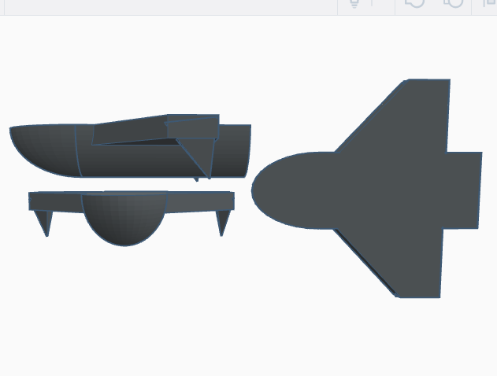

# Rescueland

## Battle Ships

## Pocket Destroyers

## Interceptors

## Dark, Grey and Light Fighters

### The Rescueland DarkFighter

Ship Type: DarkFighter Interceptor

Dimensions: 18-8-5 Metres

Speed: 8 Googolplex c

Range: Near Infinite

General: This is the main design of darkfighter Rescueland uses, because it's ability to hold many cannons while still being streamlined enough to ram another ship.

### The Rescueland GreyFighter

Ship Type: Grey Fighter Interceptor

Dimensions: 18-8-5 Metres

Speed: 3 Googolplex c

Range: Near infinite

General: A deviation from the darkfighter, this model is designed to inflict maximum damage when rammed.

### The Rescueland LightFighter

Ship Type: LightFighter interceptor

Dimensions: 15-10-6 Metres

Speed: 1 Googolplex c

Range: Near infinite

General:

# Helucky

## Battle Ships

## Pocket Destroyers

## Interceptors

### The Current Helucky Interceptor

Ship Type: Common Interceptor

Dimensions: 7-7-2 Metres

Range: 2 quintillion ly

General: This is the current Helucky interceptor design, able to be mass produced extremely quickly.

## Dark Fighters

### The Helucky DarkFighter

Ship Type: DarkFighter Interceptor

Dimensions: 7-7-5 Metres

Speed: 45 c

Range: Near Infinite

General: While this design of darkfighter may look like a TIE fighter, the design is, in fact, completely different. The 'wings' on the side are not solar panels but, instead, shields.

### The Helucky DarkFighter Frigade

Ship Type: Dark Fighter Frigade

Dimensions: 50-25-7 Metres

Speed: 5 c

Range: Near Infinite

General: This design is the largest ship ever known to be build solely out of dark material.

# Recola

## Battle Ships

## Pocket Destroyers

## Interceptors