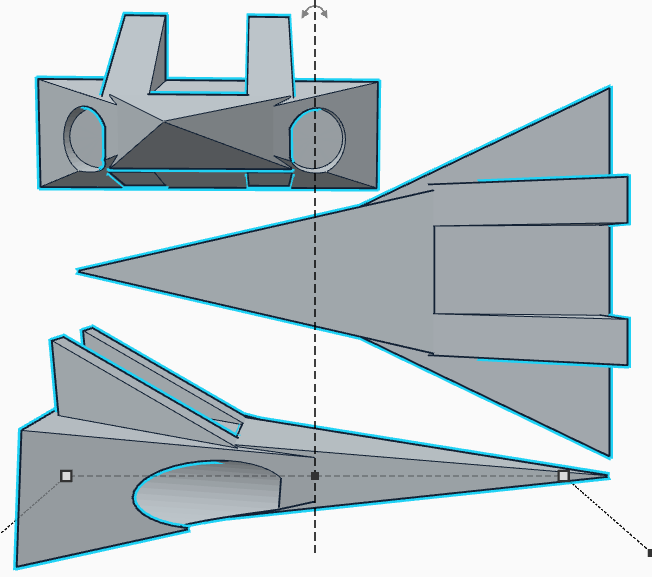
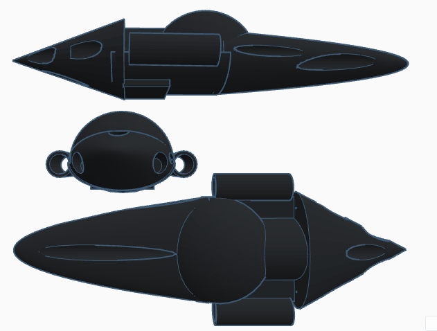
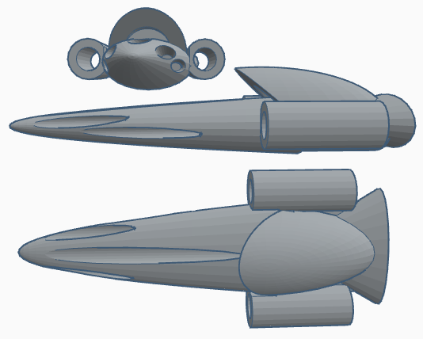
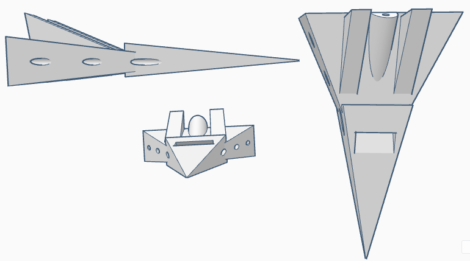
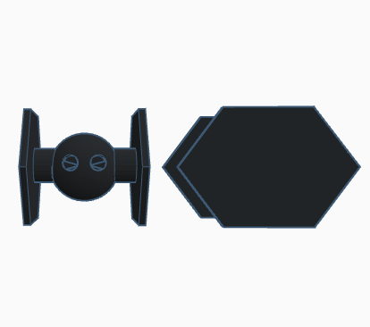
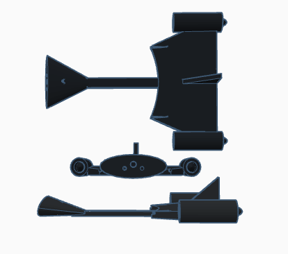
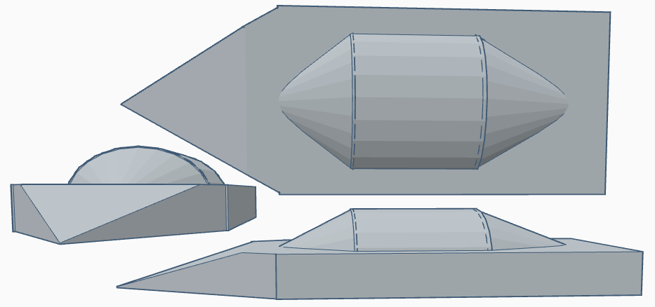

***SPDX-License-Identifier:*** *CC-BY-NC-SA-4.0*

# Rescueland

## Battle Ships

## Pocket Destroyers

## Interceptors

### Common Plamea Interceptor

**Ship Type:** Common Plamea Interceptor

**Dimensions:** 20-5-5

**Speed:** 3 Googolplex c

**Range:** Near Infinite

**General:** Rescueland has two main automated interceptor types, this being the first, built of Plamea. It is well equipped in every manner, able to carry out a great variety of tasks.

### Lightfighterling

**Ship Type:** Common Solita Interceptor (Nicknamed Lightfighterlings)

**Dimensions:** 15-10-6 Metres

**Speed:** 0.7 Googolplex c

**Range:** 213 septillion ly

**General:** Based on the Rescueland [Lightfighter](#the-rescueland-lightfighter), this interceptor was designed to create confusion regarding the actual number of lightfighters. Its enhanced durability has earned it the nickname "Lightfighterlings." Unlike the Plamea Interceptor, this model is tailored specifically for combat roles.

## Dark, Grey and Light Fighters

### The Rescueland DarkFighter

**Ship Type:** DarkFighter Interceptor

**Dimensions:** 18-8-5 Metres

**Speed:** 8 Googolplex c

**Range:** Near Infinite

**General:** This is the main design of darkfighter Rescueland uses, possessing a large cannon capacity while maintaining a sleek profile, allowing it to ram into enemy ships effectively.

### The Rescueland GreyFighter

**Ship Type:** Grey Fighter Interceptor

**Dimensions:** 18-8-5 Metres

**Speed:** 3 Googolplex c

**Range:** Near infinite

**General:** A variation of the Darkfighter, this model is engineered to maximize damage through ramming tactics and is only fitted with slit bombs.

### The Rescueland LightFighter

**Ship Type:** LightFighter interceptor

**Dimensions:** 15-10-6 Metres

**Speed:** 1 Googolplex c

**Range:** Near infinite

**General:**

# Helucky

## Battle Ships

## Pocket Destroyers

## Interceptors

**Ship Type:** Common Plamea Interceptor

**Dimensions:** 6-15-10 Metres

**Speed:** 4 Googol c

**Range:** 213 trillion ly

**General:** Once the most successful enemy interceptor design, this model demonstrates a versatility almost comparable to Rescueland vessels, despite having relatively underpowered engines.

---

**Ship Type:** Common Solita Interceptor

**Dimensions:** 7-7-2 Metres

**Range:** 2 quintillion ly

**General:** This contemporary Helucky interceptor design allows for rapid mass production, streamlining both defensive and offensive capabilities. Featuring a compact and cost-effective cannon, the interceptor can be likened to a pistol in terms of versatility and efficiency. Its small size not only makes it easy to produce and deploy but also enables seamless integration with various spacecraft, enhancing overall performance and agility while allowing for swifter reactions in combat situations.

## Dark Fighters

### The Helucky DarkFighter

**Ship Type:** DarkFighter Interceptor

**Dimensions:** 7-7-5 Metres

**Speed:** 45 c

**Range:** Near Infinite

**General:** This is the main design for Helucky’s DarkFighters. However, it lacks effectiveness due to the installation of an undersized cannon, rendering it nearly harmless.

*Disclaimer: Although it may resemble a TIE fighter, this design is fundamentally different. The 'wings' are shields, not solar panels and it is a drone, not piloted.*

### The Helucky DarkFighter Frigade

**Ship Type:** Dark Fighter Frigate

**Dimensions:** 50-25-7 Metres

**Speed:** 5 c

**Range:** Near Infinite

**General:** This frigate represents the largest ship constructed entirely from dark material known to exist.

# Recola

## Battle Ships

## Pocket Destroyers

## Interceptors

**Ship Type:** Common Solita Interceptor

**Dimensions:** 15-7-5 Metres

**Speed:** 32 Googolplex c

**Range:** 82 quadrillion ly

**General:** Although the Recola interceptor is unshielded and thus vulnerable to enemy fire, its extraordinary speed compensates for its weaknesses, allowing it to evade detection and making it difficult to target unless it follows a predictable trajectory. Unlike the Helucky Interceptor, the long, thin tube of a cannon is designed to function as a sniper weapon, granting it unparalleled range and precision, enabling operators to take out key enemy targets from a distance while minimizing their exposure to retaliation.
